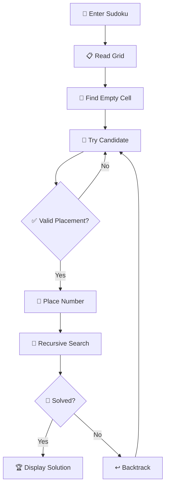

🧩 SUDOKU SOLVER

Think. Try. Backtrack. Solve.

A browser-based Sudoku Solver that uses recursive backtracking to solve valid 9×9 Sudoku puzzles. The project demonstrates constraint checking, recursion and systematic search through an interactive grid-based interface.

━━━━━━━━━━━━━━━━━━━━━━━━━━━━━━━━━━━━

🎯 THE IDEA

Sudoku is a constraint satisfaction puzzle where every number must satisfy three conditions:

┌─────────────────────────────┐
│  ✓ Unique within its row   │
│  ✓ Unique within its column │
│  ✓ Unique within its 3×3   │
│    sub-grid                │
└─────────────────────────────┘

The solver systematically explores possible values and reverses incorrect choices whenever they lead to an invalid state.

━━━━━━━━━━━━━━━━━━━━━━━━━━━━━━━━━━━━

✨ WHAT IT CAN DO

🔢 Interactive 9×9 Grid
Enter a Sudoku puzzle directly into the browser.

🧠 Automatic Solving
Solve a valid puzzle using recursive backtracking.

✅ Constraint Validation
Checks rows, columns and 3×3 sub-grids before placing values.

↩️ Intelligent Backtracking
Reverts unsuccessful choices and explores alternative possibilities.

⚡ Instant Feedback
Displays the solving status directly in the interface.

🎨 Visual Distinction
Original values and solver-filled values are visually differentiated.

🖥️ Browser-Based Interface
Provides an interactive frontend instead of a purely console-based solver.

━━━━━━━━━━━━━━━━━━━━━━━━━━━━━━━━━━━━

🧠 THE ALGORITHM

The core strategy is BACKTRACKING.

```text
            Find Empty Cell
                  │
                  ▼
          Try Possible Number
                  │
                  ▼
           Is Placement Valid?
             /          \
           YES           NO
            │             │
            ▼             │
       Place Number       │
            │             │
            ▼             │
      Solve Remaining     │
         Puzzle           │
        /      \          │
     Success   Failure    │
       │          │       │
       ▼          ▼       │
    Complete   Backtrack ◄┘
```

🔍 STEP-BY-STEP

① Find an empty position.

② Try candidate values from 1 to 9.

③ Check whether the candidate satisfies Sudoku constraints.

④ Place the value if it is valid.

⑤ Recursively continue solving the remaining grid.

⑥ If the path fails, remove the previous value.

⑦ Try another possibility until the puzzle is solved or no valid solution remains.

━━━━━━━━━━━━━━━━━━━━━━━━━━━━━━━━━━━━

🏗️ SOLUTION FLOW



━━━━━━━━━━━━━━━━━━━━━━━━━━━━━━━━━━━━

💻 INTERFACE

The application provides a simple workflow:

🧩 Enter Puzzle
↓
🔍 Press Solve
↓
🧠 Backtracking Engine
↓
✅ Solved Grid
↓
📢 Result Status

━━━━━━━━━━━━━━━━━━━━━━━━━━━━━━━━━━━━

🛠️ TECHNOLOGY

🌐 HTML5
🎨 CSS3
⚡ JavaScript
🧠 Recursion
↩️ Backtracking
🔎 Constraint Checking
🧩 DOM Manipulation

━━━━━━━━━━━━━━━━━━━━━━━━━━━━━━━━━━━━

📂 PROJECT STRUCTURE

```text
sudoku-solver/
│
├── index.html
├── script.js
├── style.css
└── README.md
```

━━━━━━━━━━━━━━━━━━━━━━━━━━━━━━━━━━━━

📚 DAA CONCEPTS

This project demonstrates several important algorithmic concepts:

🧠 Recursive Problem Solving

↩️ Backtracking

🔐 Constraint Satisfaction

🔎 Systematic Search

🧩 State Exploration

⏱️ Time Complexity Analysis

💾 Space Complexity Analysis

🔄 Recursive State Restoration

━━━━━━━━━━━━━━━━━━━━━━━━━━━━━━━━━━━━

⏱️ COMPLEXITY

For a general 9×9 Sudoku, the backtracking search can have exponential worst-case behavior because multiple candidate configurations may need to be explored.

The recursive depth is bounded by the number of empty cells.

The practical performance depends heavily on the puzzle configuration and the order in which candidate values are explored.

━━━━━━━━━━━━━━━━━━━━━━━━━━━━━━━━━━━━

💡 WHY BACKTRACKING?

Backtracking fits Sudoku naturally because every placement creates a new state.

If the state remains valid, the solver continues.

If the state becomes impossible, the solver returns to the previous decision and tries another possibility.

In simple terms:

🟢 Make a valid choice
↓
🟢 Continue
↓
🔴 Dead end?
↓
↩️ Undo
↓
🔁 Try another choice

━━━━━━━━━━━━━━━━━━━━━━━━━━━━━━━━━━━━

🌟 PROJECT HIGHLIGHTS

🧠 Implemented a recursive backtracking Sudoku solver.

🔎 Built constraint validation for rows, columns and 3×3 sub-grids.

🧩 Connected the solving algorithm with an interactive browser interface.

🎨 Added visual distinction between user-provided and solver-generated values.

⚡ Added asynchronous UI feedback while the puzzle is being processed.

📚 Demonstrates practical application of Design and Analysis of Algorithms concepts.

━━━━━━━━━━━━━━━━━━━━━━━━━━━━━━━━━━━━

🚀 POSSIBLE EXTENSIONS

🎯 Smart Cell Selection
Choose the most constrained empty cell first to reduce unnecessary exploration.

📊 Solving Visualization
Animate the algorithm's decisions and backtracking process.

🧩 Puzzle Generator
Generate new Sudoku puzzles with different difficulty levels.

📷 Image Input
Recognize Sudoku grids from images.

🏆 Difficulty Detection
Estimate puzzle difficulty based on solving complexity.

📱 Enhanced Responsive Interface
Improve usability across mobile and desktop devices.

━━━━━━━━━━━━━━━━━━━━━━━━━━━━━━━━━━━━

🧩 THE CORE LESSON

A wrong choice isn't failure.

In backtracking, it's information.

Choose → Explore → Detect Dead End → Undo → Try Again.

That is the algorithmic thinking behind the Sudoku Solver.


